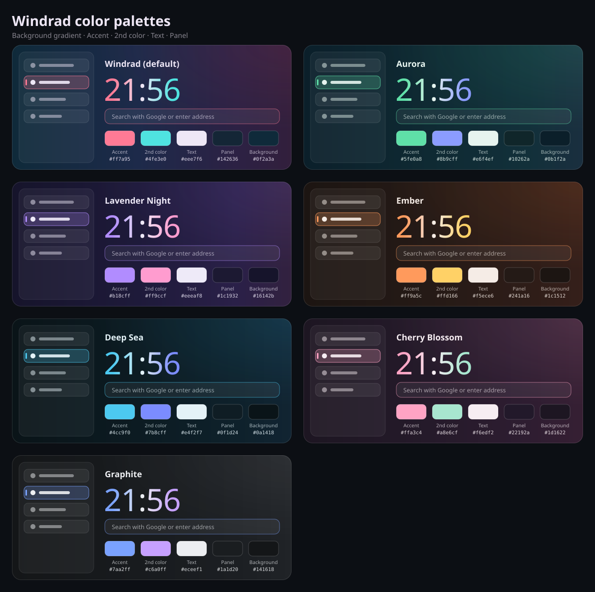

# Windrad for Firefox

A glassmorphism `userChrome.css` theme for Firefox: floating rounded content
area, vertical tabs in a Zen-like style, smooth animations and several color
palettes. Everything is plain CSS – no scripts, no extra software.

---

## Features

- **Glass look** – translucent tabs, toolbar and popups with soft borders
- **Floating content** – the web page sits in a rounded frame (Zen look)
- **Vertical tabs** – Zen-style sidebar with pinned tabs as tiles, accent
  stripe on the active tab, soft fade-out for long titles
- **Animations** – new tabs slide in and push the others aside smoothly,
  closing tabs fade out, address bar dropdown unfolds, download button bounces
- **Loading bar** inside the address bar
- **Close button only on hover** (or hidden completely, Zen style)
- **Tab preview, dropdowns and menus** in the theme colors
- **Scrollbars** that fade from one accent color to the other while scrolling
- **Optional layouts**: Zen layout, Helium layout (everything in one bar),
  adaptive background
- **Performance switches** for slower machines

---

## Installation

1. **Enable custom stylesheets**
   Open `about:config`, search for
   `toolkit.legacyUserProfileCustomizations.stylesheets` and set it to `true`.

2. **Find your profile folder**
   Open `about:support` → *Profile Folder* → **Open Folder**.

3. **Copy the files**
   Create a folder named `chrome` in the profile folder (if it doesn't exist)
   and put the files inside:

   ```
   <profile folder>/
   └── chrome/
       ├── userChrome.css     ← browser UI
       └── userContent.css    ← scrollbars on web pages (optional)
   ```

4. **Switch on the options you want** (see below).

5. **Restart Firefox completely.**

---

## Options (`about:config`)

All options are **Boolean** preferences. To create one: open `about:config`,
type the name into the search field, choose **Boolean** and click **+**.
Set it to `true` to enable, `false` (or delete it) to disable.

### Recommended

| Preference | What it does |
|---|---|
| `toolkit.legacyUserProfileCustomizations.stylesheets` | **Required.** Lets Firefox load the theme. |
| `userchrome.windrad-theme` | Turns on the Windrad color palette (gradient window, accent colors, panels). Without it, colors come from your current Firefox theme. |
| `sidebar.verticalTabs` | Firefox's own setting for vertical tabs (also in *Settings → General → Browser layout*). |

### Layouts

| Preference | What it does |
|---|---|
| `userchrome.zen-layout` | Zen-style sidebar: pinned tabs as a tile grid, compact top bar with a centered address bar. Only with vertical tabs. |
| `userchrome.helium-layout` | Everything in one bar: buttons and address bar on the left, tabs in the middle, icons on the right. Only with horizontal tabs. |
| `userchrome.adaptive` | Background follows the color of the current page. Needs the extension *Adaptive Tab Bar Colour*. |

### Tabs

| Preference | What it does |
|---|---|
| `userchrome.no-close-button` | Hides the close button completely. Close tabs with the middle mouse button. (By default it only shows on hover.) |

### Performance

| Preference | What it does |
|---|---|
| `userchrome.performance` | Turns off the most expensive effects: rounded corners of the web page and the loading bar. |
| `userchrome.no-rounded` | Only removes the rounded corners of the web page (biggest gain when scrolling or watching videos). |
| `userchrome.no-loadbar` | Only removes the loading bar in the address bar. |

### For the scrollbar animation

| Preference | What it does |
|---|---|
| `layout.css.scroll-driven-animations.enabled` | Needed if the scrollbar stays one color instead of fading while scrolling (older Firefox versions). |

---

## Colors

The palette lives in section **9) COLOR THEME** of `userChrome.css`
(search for `palette`). Replace the values and restart Firefox.

```css
--wd-night:   #0f2a3a;   /* gradient, left            */
--wd-blue:    #1d2a4a;   /* gradient                  */
--wd-violet:  #2c2144;   /* gradient                  */
--wd-wine:    #321f3c;   /* gradient, right           */
--wd-glow-top:    rgba(224, 80, 106, 0.04);  /* glow top right    */
--wd-glow-bottom: rgba(224, 80, 106, 0.04);  /* glow bottom right */
--wd-accent:  #ff7a95;   /* active tab, focus, accents */
--wd-text:    #eee7f6;   /* text                       */
--wd-panel:   #142636;   /* popups, menus, dropdowns   */
```

The second color (where the scrollbar fades to) is set in section
**12) SCROLLBARS** (`--en-scroll-top`, `--en-scroll-bottom`) and in
`userContent.css` for web pages.

### Palettes

| Name | Background (4 stops) | Accent | 2nd color | Text | Panel |
|---|---|---|---|---|---|
| **Windrad** (default) | `#0f2a3a` `#1d2a4a` `#2c2144` `#321f3c` | `#ff7a95` | `#4fe3e0` | `#eee7f6` | `#142636` |
| **Aurora** | `#0b1f2a` `#0f2a33` `#12303a` `#1a2f3f` | `#5fe0a8` | `#8b9cff` | `#e6f4ef` | `#10262a` |
| **Lavender Night** | `#16142b` `#1e1a3a` `#2a2048` `#32213f` | `#b18cff` | `#ff9ccf` | `#eeeaf8` | `#1c1932` |
| **Ember** | `#1c1512` `#251a16` `#2e1d18` `#351f1a` | `#ff9a5c` | `#ffd166` | `#f5ece6` | `#241a16` |
| **Deep Sea** | `#0a1418` `#0c1b22` `#0e212b` `#112432` | `#4cc9f0` | `#7b8cff` | `#e4f2f7` | `#0f1d24` |
| **Cherry Blossom** | `#1d1622` `#251a2a` `#2e1d31` `#361f33` | `#ffa3c4` | `#a8e6cf` | `#f6edf2` | `#22192a` |
| **Graphite** | `#141618` `#181b1e` `#1c1f23` `#202327` | `#7aa2ff` | `#c6a0ff` | `#eceef1` | `#1a1d20` |



### Other settings you can change

Near the top of the matching section in `userChrome.css`:

| Variable | Section | Default | |
|---|---|---|---|
| `--en-radius` / `--en-radius-big` | 1 | `8px` / `12px` | corner rounding |
| `--en-vtab-height` | 1 | `32px` | height of vertical tabs |
| `--en-load-height` / `--en-load-speed` | 10 | `2px` / `1.1s` | loading bar |
| `--en-newtab-speed` | 27 | `280ms` | new tab animation |
| `--en-stripe-width` | 28 | `3px` | accent stripe on the active tab |
| `--en-close-hover` | 28 | `#ff8a9c` | close button color on hover |

---

## Troubleshooting

- **Nothing changes** – check that `toolkit.legacyUserProfileCustomizations.stylesheets`
  is `true`, the folder is called exactly `chrome`, the file exactly
  `userChrome.css` (not `userChrome.css.txt`), and Firefox was fully restarted.
- **No animations at all** – Windows *Settings → Accessibility → Visual effects →
  Animation effects* is off. Firefox then disables animations on purpose.
- **Popups or the address bar dropdown don't close** – in the Browser Toolbox,
  *Disable Popup Auto-Hide* is still on. Turn it off.
- **Something looks off after a Firefox update** – Firefox sometimes renames UI
  elements. Please open an issue with a screenshot (and the element name from
  the Browser Toolbox if you can).
- **New-tab animation plays on startup** – expected: Firefox marks all restored
  tabs as "faded in", so they animate once.

---

## Compatibility

Made for current Firefox desktop releases with the *Nova* design (2026) on
Windows. Most of it also works on Linux and macOS, but it is tested on Windows.

---

## License

MIT – free to use, change and share.
